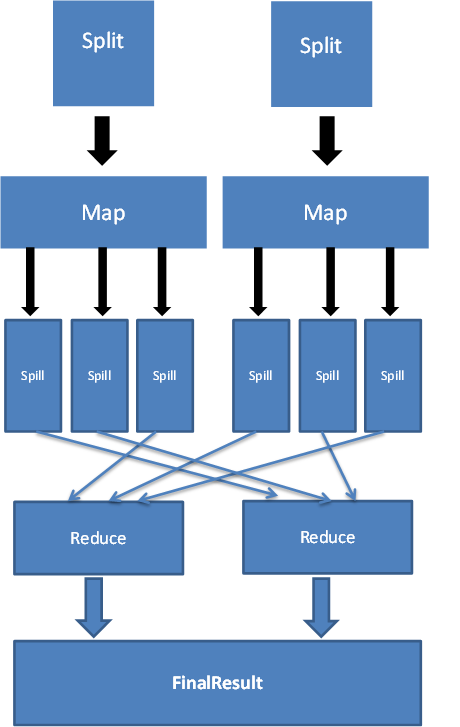

# Introduction to MapReduce

## Foreword

I learned many distributed system concepts this semester in course [CS 6421 Distributed Systems - Fall 2018](https://gwdistsys18.github.io/). One of the key concepts interests me is MapReduce. It was proposed by Google staff Jeffery Dean and Sanjay Ghemawat in [this](https://pdos.csail.mit.edu/6.824/papers/mapreduce.pdf) very famous publication. Although MapReduce has many disadvantages and is being replaced gradually nowadays, it still is a milestone concept in parallel and distributed computing. I will introduce MapReduce and its application Hadoop MapReduce in this blog.

## MapReduce

### What is MapReduce
The formal definition:

> MapReduce is a programming model and an associated implementation for processing and generating large data sets. Users specify a *map* function that processes a key/value pair to generate a set of intermediate key/value pairs, and a *reduce* function that merges all intermediate values associated with the same intermediate key.[[1]](https://pdos.csail.mit.edu/6.824/papers/mapreduce.pdf)

There are two important concepts of function, *map* and *reduce*. The *map* function takes an input pair and produces a set of intermediate key/value pairs. The *reduce* function accepts an intermediate key I and a set of values for that key, then merges these values to form a possibly smaller set of values.

Take an example, we have a text document includes:
```
Hello CS6421
Hello Distributed
Distributed Systems
Hello Professor
Professor Wood
Hello World
```
We run *map* function, then get these intermediate key/value pairs:
```
(Hello, 1)
(CS6421, 1)
(Hello, 1)
(Distributed, 1)
(Distributed, 1)
(Systems, 1)
(Hello, 1)
(Professor, 1)
(Professor, 1)
(Wood, 1)
(Hello, 1)
(World, 1)
```
Then we run *reduce* function and get reduced set of values
```
(Hello, 1)
(Hello, 1)
(Hello, 1)
(Hello, 1)
=> (Hello, 4)

(CS6421, 1)
=> (CS6421, 1)

(Distributed, 1)
(Distributed, 1)
=> (Distributed, 2)

(Systems, 1)
=> (Systems, 1)

(Professor, 1)
(Professor, 1)
=> (Professor, 2)

(Wood, 1)
=> (Wood, 1)

(World, 1)
=> (World, 1)
```

### MapReduce Implementation
1. Idea: Divide the input data of the Map call into a collection of M data segments. The input data segments can be processed in parallel on different machines. Use the partition function to divide the intermediate key value generated by the Map call into R different partitions, and the Reduce call is distributed to multiple machines for execution.
1. Steps:
    * The MapReduce library first called by the user program divides the input file into M data slices. The user program then creates a large number of copies of the program in the cluster.
    * There is a special program called **Master**. The other programs in the copy are the worker programs, and the tasks are assigned by the master.
    * The worker program assigned the map task reads the relevant input data segment, parses the key/value pair from the input data segment and output the intermediate key/value pairs and cache them in memory.
    * The key/value pairs in the buffer are divided into R areas, and then periodically written to the local disk, and thus R temporary files are generated. The locations of these buffered pairs will be passed back to the master and forward to reduce workers.
    * The Reduce worker uses RPC to read the buffer data from the disk of the host where the Map worker is located. When the Reduce worker reads all the intermediate data, the keys with the same key value are aggregated by sorting the keys. If the intermediate data is too large to finish sorting in memory, then it is sorted externally.
    * The Reduce worker program traverses the sorted intermediate data. For each unique intermediate key value, the Reduce worker program sets the key value and its associated intermediate value passed to the user's custom Reduce function. The output of the Reduce function is appended to the output file of the partition to which it belongs.
1. Diagram:

    
1. Fault Tolerance

    As we learned in class, fault tolerance is very important for a distributed system. MapReduce library is designed in a distributed environment so that the library must tolerate machine failures gracefully. Some possible failure cases are considered following:

    * Worker Failure
        * If no response is received from a worker in a certain amount of time, the master marks the worker as failed.
        * Completed map tasks are re-executed on a failure because their output is stored on the local disk(s) of the failed machine and is therefore inaccessible.
        * Completed reduce tasks do not need to be re-executed since their output is stored in a global file system.
    * Master Failure: use periodic checkpoints of the master data. If the master task dies, a new copy can be started from the last checkpointed state.
    * Semantics in the Presence of Failures: rely on atomic commits of map and reduce task outputs to achieve this property.

### Hadoop MapReduce
Based on that famous article, Hadoop implements MapReduce framework as its core architecture to ensure its reliable and scalable. Next I will introduce a typical Hadoop MapReduce mechanism:
* Input Split: MapReduce computes input splits based on the input file. Each input split is for a map task. The input split stores not the data itself, but a slice length and a record. An array of the location of the data, the input split is often closely related to the block of HDFS.
* Map: Map function is implemented according to the requirement. Map function is relatively well controlled, and operated on the data storage node.
* Combine: An optional optimization operation of reduce function. It is used to combine the value with the same key to possibly reduce the size of file and improve the efficiency of transportation.
* Shuffle: The shuffle process partitions, sorts, and splits the results of the Map. Then, the outputs belonging to the same partition are merged and written on the disk, and finally a partitioned file is obtained. The key-value pairs in each partition are sorted in ascending order by key value.
* Reduce: Reduce function is implemented according to the requirement and outputs into HDFS.

### Conclusion

According to the learning above, I will give my own understanding of MapReduce. I treat MapReduce as computational functions with distributed support. From a computational point of view, the MapReduce framework accepts key-value pairs of various formats as input, and after reading the calculation, finally generates an output file in a custom format. From a distributed point of view, the input files of distributed computing are often large in scale and distributed on multiple machines. The single-machine computing is completely unsupportable and inefficient. Therefore, the MapReduce framework needs to provide a mechanism to calculate this. Expanded to an infinite scale machine cluster.

In the distributed computing MapReduce framework, in order to complete this job, it performs a two-step strategy. First, it is split into several Map tasks, which are assigned to different machines for execution. Each Map task takes input files. Part of it as its own input, after some calculations, to generate an intermediate file of a certain format, which is exactly the same as the final required file format, but only contains a part of the data. So, when all Map tasks are completed, it goes to the next step to merge the intermediate files to get the final output file. At this point, the system will generate several Reduce tasks, which are also assigned to different machines for execution. Its goal is to summarize the intermediate files generated by several Map tasks into the final output file. Of course, this summary is not always as straightforward as 1 + 1 = 2, which is the value of the Reduce mission. After the above steps, finally, the job is completed and the required target files are generated. The key to the whole algorithm is to add an intermediate file generation process, which greatly increases the flexibility and ensures the distributed scalability.

### Reference
[[1] MapReduce: Simplified Data Processing on Large Clusters, *Jeffrey Dean and Sanjay Ghemawat*, January 2008](https://pdos.csail.mit.edu/6.824/papers/mapreduce.pdf)
